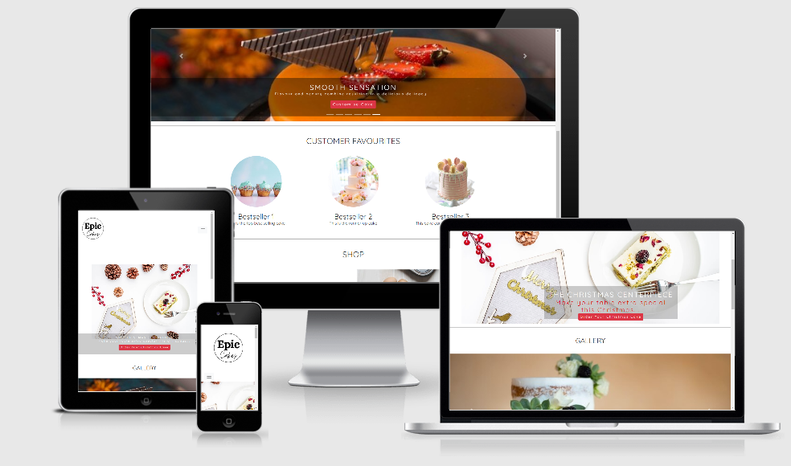

# Epic Cakes Website

[Link to Live project](/https://shoreenb.github.io/epic-cakes/)

This website aims to attract potential customers and baking enthusiasts who want to purchase a cake, buy baking equipment and/or find inspiration
and learn new skills.

The main aim of the website is to advertise bespoke cakes and baking equipment to a wider audience and provide enough options that they will find
something they like enough to follow the process through to the order form. The cake market is quite saturated so the UX will have to be
image-driven and easy to navigate, with minimal steps to the order form, which are as clear and easy to follow as possible in order to retain
customer interest.

## User Experience (UX)

### Ideal customer

#### The Ideal customer:

- Lives in within the M25
- Requires a cake to celebrate an occasion
- Is looking for baking equipment to purchase

#### People who visit the website:

- Want to purchase a bespoke cake
- Want to purchase baking equipment
- Are looking for baking inspiration and/or information on baking skills
- Want to join a community of like-minded baking enthusiasts

#### How does this website meet the needs of potential customers?

This website allows the user to order a cake, find information on baking skills and buy cake equipment all in one place.
The user can:

- Find the information they require without being overloaded.
- Navigate the website with ease.
- Easily follow the steps through to the order form, which is the aim of the website.

### User Stories

#### First Time Visitor:

1. As a first time visitor to the website, I want to quickly and easily navigate the site so that I can find the cake I want to order without too
   much effort.
2. As a first time visitor to the website, I want to see cakes that have been made for previous customers so that I can see the standard of work
   in detail to decide if I want to put in an order.
3. As a first time visitor to the website, I want to read testimonials and visit their social media accounts to see how previous customers felt about
   their cakes to see if they can be trusted and help me to feel confident that I will be getting a great product and value for money.

#### Potential Customer:

1. As a potential customer, I want to easily find the options for the bespoke cake or baking equipment that I want to order.
2. As a potential customer, I want pricing to be clear so that I can decide whether the options i've chosen are within my budget.
3. As a potential customer, I want to clearly understand the ordering process so that I can follow the steps to the order form.

#### Returning Visitor:

1. As a returning visitor, I want to find social media links so that I can see the latest creations or special offers.
2. As a returning visitor, I want to find out how to join the community and/or learn new baking skills.
3. As a returning visitor, who has decided on what I want to order, I want to easily find where I can order and for the ordering process to be simple.

#### Strategy

The aim of this website was to create a website that brings together a baking community, showcases the cakes and allows customers to buy baking
equipment all in one place, whilst mainly using images so that the design remains as minimal and user-friendly as possible.

#### Scope

Customers can scroll through a gallery of cakes to find the cake they would like to purchase and then click on that cake for a larger image
and to see the order options. They can also watch a video tutorial to learn baking skills, learn more about the company, purchase baking equipment,
visit the company's social media pages or contact the company if they wish to.

#### Structure

- Home: An overview of any announcements and seasonal offers as well as highlighting customer favourites and links to the shop, gallery and video
  tutorials.
- Gallery: Images of available cakes and previous orders.
- Cakes: A more detailed look at the cakes along with order options i.e. cake sizes.
- Customer Favourites: A selection of the company's bestselling cakes.
- Shop: Where the customer can purchase baking equipment for sale.
- Video tutorials: A video tutorial on baking skills with a link to the Company's YouTube account

### Skeleton

#### Wireframes

I created wireframes using Balsamiq, however the layout did change slightly during the implementation process:

[Home Page](wireframes/home.pdf)\
[Cake Order Page](wireframes/cake-order.pdf)\
[Order Submission Page](wireframes/order-submission.pdf)

#### Mockups

I used this site to create responsive Mockups:

### Surface

In order to highlight the cakes as the main focus, the colour scheme will be subtle and writing will be minimal to maintain a clean, modern look:

#### Colour scheme

The aesthetic of this website is minimal. The cake designs themselves have a variety of colours and decorations, so the colour scheme was kept
mainly monochromatic: #ffffff / #fafafa / #000000 for text and #777 / #8f8f8f for accents or backgrounds.

### Typography

The main font used is a sans-serif font 'Quicksand' with an alternative sans-serif if it is not accessible. This font is clear, modern and easy to
read, which is in-keeping with the theme.

### Imagery

Images on this website are the main focus so they need to be high quality and responsive, without much interference from the backgound.

## Features

**Header**- The navigation bar is the same across all pages so the user can easily navigate through the website

- The logo is also present on all pages and is a link back to the home page if the user needs to get back to it quickly

- When hovering over the navigation links they change to grey and the text colour changes to white, letting the user know it is clickable

- The navigation bar collapses into a hamburger menu when viewed on smaller devices such as mobiles and ipads.

- Contrasting monochromatic colours across the site light help the user to see the features easily and therefore navigate the site more efficiently.

**Links** - All links that are hovered over change colour or the mouse hand appears to notify the user of a link.

- All images have an alternative text to help screen readers, or information if the image link is broken.

**Buttons** - All buttons have the same style to help with consistency, which darkens when hovered over.

**Responsiveness** - All pages are responsive and have the same functionality on different devices

**Footer** - A footer navigation bar has been added at the bottom of the page so the user doesn't have to keep scrolling to the top to navigate the
site.

- Social links are grouped together so they can easily be located and the background changes colour when hovered over.

### Home Page Features

**Hero Image** - The main page has a hero image with a call-to-action button that leads to the Cake page. The main purpose is to hightlight any
limited seasonal offers or cake designs that the user may be attracted to.

**Gallery** - An image carousel that is responsive and changes depending on the viewport. The allows the cakes to be viewed in better detail,
for example, in full screen width on a smartphone.

**Customer Favourites** - Card elements display the current top three best selling cakes and both the image and text are linked to the cake page
incase the user wants to order them.

**Shop** - The final section is an external link to a shop where the user can buy baking equipment (currently lakeland) along with a carousel of
images showing the user what equipment they may want to buy.

### Cake Page Features

If the user wants to see a specific cake in more detail, they can click on the 'Cake' link in the header or footer or on one of the images in the
gallery or customer favourites section. This leads to the Cake page, which has an individual images of the cakes, each in their own section
and a short description with a call-to-action button should the user which to order the cake.

### Order Form

Once the user click the 'Order Cake' button they will be led to the order form, which requires the fields to be completed before the form can be
submitted

### Future Features

- **Video Tutorials** - After initially planning to have a video tutorial section with an embedded video player on the home page, however,
  due to time restraints, this can be implemented at a later detailed

- **Active Navigation Link** - The users experience would be enhanced if the page they were on stayed highlighted in the navigation bar.

- **Quick Buy Option** - If the user knows what cake they would like to order, they can go straight to the order form, which would be more
  efficient than clicking through

- **Design a Cake** - A more flexible and interactive option where the user can input various cake flavours, buttercream and decoration to design
  their own unique cake

- **Testimonials** - Reviews from previous customers are a good way to get new users to trust a company.

- **Cake Categories** - As cakes are added to the website, a dropdown menu clearly categorising the cakes so the visitor can easily find what they
  are looking for may be required

## Technologies Used

### Languages Used

- HTML5
- CSS3
- JavaScript

### Frameworks, Libraries & Programs Used

1. Bootstrap v4.5.2: Used for custom components such as navigation bar, image carousels and cards
2. Google Fonts:
3. Font Awesome: Used to add social icons
4. JQuery: Used in some components that can click and collapse such as nav bar toggle
5. popper.js: Used in some components that can click and collapse such as nav bar toggle
6. Git: Git was used for the ability to track changes and for version control
7. GitPod: GitPod, which is connected to GitHub, hosted the coding space and allowed the project to be committed to the GitHub repository
8. Github: Used to host the project files and publish the live website with Git Pages
9. Balsamiq: Used to create the wireframes
10. Canva: Used to create the logo
11. TinyJPG: Used to compress images

## Testing

- To test the ease of navigation and functionality, the website was shared with various friends and family members, all with varying levels of
  computer literacy. No issues were discovered as they navigated the site.//

- The functionality of the website was also tested and all buttons, links and components (carousels) worked as expected.

### Compatibility Testing

**Browser** - Tested using the Brave browser and Google Chrome

| Screen size |                  | Browser            |                   |
| ----------- | ---------------- | ------------------ | :---------------: |
|             | Chrome           | Brave              | Internet Explorer |
| Mobile      | heavy_check_mark | :heavy_check_mark: |       Tick        |
| Tablet      | Not Tested       | Not Tested         |    Not Tested     |
| Desktop     | Tick             | Tick               |       Tick        |

**OS Compatibility** - Tested on Windows 7 & 10, Android 8.1 and 10.0. It has not as yet been tested on other Operating Systems

**Devices** - The devices used in testing include an Oppo X2 Lite, Samsung 8, One Plus, Dell Laptop and Asus Packages

**Chrome DevTools** - This website was thoroughly tests for responsiveness on [Chrome DevTools.](https://developers.google.com/web/tools/chrome-devtools)
Viewport sizes from small (e.g. iPhone5), to large (Desktop 1200px and above) were simulated.

### CSS3 validator - Pass

    

### HTML5 validator

- Known Issues - There are error/warning messages for aria labels, which are attached to Bootstrap Modal elements and Font awesome icons.
- [W3C Markup Validator](https://validator.w3.org/) - Home Page - Pass
- [W3C Markup Validator](https://validator.w3.org/) - Cake Page - Pass
- [W3C Markup Validator](https://validator.w3.org/) - Order Page - Pass

### Testing User Stories from User Experience (UX) Section

#### First Time Visitor:

1. As a first time visitor to the website, I want to quickly and easily navigate the site so that I can find the cake I want to order without too
   much effort.

   - The home page has 4 clear sections to give the user a clear idea what content can be found on the website, with links to these sections in
     the nav bar and footer.
   - All the pages of the site have the same header and footer to maintain some consistency so the user doesn't feel confused

2. As a first time visitor to the website, I want to see cakes that have been made for previous customers so that I can see the standard of work
   in detail to decide if I want to put in an order.

   - The cake page has a list of cakes and a brief description with the option to order. More cakes can be added to this page over time, and then
     the layout could change to prevent the boredom of scrolling through the repetitive sections.
   - The bright colours of the cakes contrast with the monochrome background colours to highlight the cakes and draw the visitors in.

3. As a first time visitor to the website, I want to read testimonials and visit their social media accounts to see how previous customers felt about
   their cakes to see if they can be trusted and help me to feel confident that I will be getting a great product and value for money.
   - Due to time restraints, the testimonials sections has not yet been added but is a feature that will be implemented in future
   - Social media icons are added in the footer where the user can find previous customer's cakes and comments.

#### Potential Customer:

1. As a potential customer, I want to easily find the options for the bespoke cake or baking equipment that I want to order.

   - The header and footer navigation bars have links straight to the cake page, so the potential customer can go through to the
     order form to order a cake in 2-clicks.
   - There are also links to the cake page in the gallery, if a potential customer finds a cake they like and want more information or to just order.
   - The website can be viewed on various devices to ensure that the experience of the visitor is not impacted. They should be able to see the
     images clearly whether on a mobile or desktop.

2. As a potential customer, I want to know what the featured cakes are and if there are any current offers.
   - The hero image changes seasonally so customers will want to come back to see what is new. Current offers can also be promoted with a banner as
     it is the first image the user can see on the website.
3. As a potential customer, I want the steps to the order form to be few and easy to follow.
   - There are only 2 steps to the order form, which can potentially be reduced to one if a link to the order form is added to the website in future.
   - In order to prevent a potential customer from constantly having to click between the cakes and the order form, the order form button is located
     next to each cake.

#### Returning Visitor:

1. As a returning visitor, I want to find social media links so that I can see the latest creations or special offers.

   - Social media links are located on the footer of every page so that the visitor can find various methods of contact, interaction and
     communication if desired.
   - The hero image would be regularly updated to inform visitors of the latest creations and offers.

2. As a returning visitor, I want to find out how to join the community and/or learn new baking skills.

   - The visitor can easily and quickly connect with the community using the social media links in the footer.
   - The YouTube link is also in the footer where the visitor can watch video tutorials.

3. As a returning visitor, who has decided on what I want to order, I want to easily find where I can order and for the ordering process to be simple.
   - A returning visitor can go straight through to the cake page, where they can choose their desired cake and click on the order button. Clicking
     on the button next to the image of the cake, helps remind the customer of the cake they want to order before going through to the order form.
   - The order form has fields that need to be completed before the form can be submitted, so there is no chance of empty fields being sent.

### Known Bugs

None at this time.

## Deployment

### Github Pages

This website was published using [GitHub Pages](https://pages.github.com/). The procedure is outlined below:

1. Go to [Github](https://github.com/) and log in.
2. Your repositories are listed on the left-hand side. Click on the repository that you want to open
   [This is the Repository for this project.](https://github.com/shoreenb/epic-cakes)
3. Underneath the repository name are some headings: Code, Issues, Pull requests, Actions, Projects, Wiki, Security, Insights and Settings.
   Click on Settings.
4. Scroll down until you see the heading 'GitHub Pages'
5. Under source is a dropdown menu, click on it and select 'master'.
6. The page will then reload and you will see the link of your published page displayed above the Source title.
7. It may take a few minutes for the background of the link to turn green, but once it does, your site is published and you will be able to open it.

### Forking The GitHub Repository

Forking the GitHub Repository makes a copy of the original repository so that you can view and/or make changes without affecting the original
repository. To do this:

1. Go to [Github](https://github.com/) and log in.
2. Locate a Repository (this is the one for this project - [Repository](https://github.com/shoreenb/epic-cakes))
3. Above the "Settings" Button on the menu, on the right-hand side locate the "Fork" Button. It is next to the 'star' button.
4. You should now have a copy of the original repository in your GitHub account.

### Cloning

1. Go to [Github](https://github.com/) and log in.
2. Locate a Repository (this is the one for this project - [Repository](https://github.com/shoreenb/epic-cakes))
3. Under the repository name, click the green "Clone or download" button.
4. To clone the repository using HTTPS, copy the link under "Clone with HTTPS".
5. Open a terminal and if you need to, change the current working directory to the location where you want the cloned directory to be made.
6. Type `git clone`, and then paste the URL you copied in Step 3 on GitHub.

`$ git clone https://github.com/YOUR-USERNAME/YOUR-REPOSITORY`

7. When you press Enter your local clone will be created.

## Credits

### Code

- Bootstrap library was used to for the navbar, image carousels, form and card components. It was also used for the grid layout and
  responsive design.
- w3schools library was used for the rounded circle shape for the footer logo and customer favourites images.

### Content

- Some inspiration for the nav bar and footer was taken from the Code Institute Modules: Love Running (circle image inspiration) and
  Resume project (nav bar hover and social media hover)

- All code was written by the author: Shoreen Beckford
- To write this README file the most helpful documents were:
  - Code Institute [SampleREADME](https://github.com/Code-Institute-Solutions/SampleREADME/blob/master/README.md)
  - Code Institute [README Template](https://github.com/Code-Institute-Solutions/readme-template.md)
  - Liga Baikova - Boredom Guide [README](https://github.com/LigaMoon/Boredom-guide.md)
  - Anna Greaves - portrait-artist [README](https://github.com/AJGreaves/portrait-artist.md)
  - [Markdown Cheatsheet](https://github.com/adam-p/markdown-here/wiki/Markdown-Cheatsheet#lists)
  - [Markdown Tutorial](https://commonmark.org/help/tutorial/index.html)
- YouTube Tutorial on Carousels by [Adrian Twarog](https://www.youtube.com/watch?v=ku_97a6Bgkg&t=173s)

### Media

- All images used were taken from [UnSplash](https://unsplash.com/)
- Logo created with [Canva](https://www.canva.com/)

### Acknowledgements

- I decided to choose the theme of this project because my mum needs a website to market her delicious cakes!
- The utmost gratitude goes to everyone from the slack community who replied to my questions and gave constructive helpful feedback.
  Special thanks to JimLynx who helped me sort at last minute issue!
- Many thanks to my mentor for guiding me through this process.
- Last but not least thanks to my husband who looked after the family whilst I was glued to this project!

#### Releases

No releases published

#### Packages

No packages published
